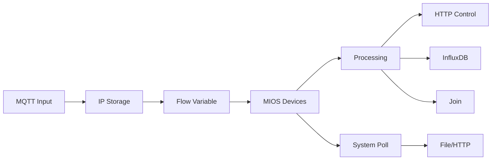

# MIOS Home Automation Hub (Node-RED Flow)

A comprehensive and robust Node-RED flow acting as a central automation hub for a Vera (MIOS) based smart home. This flow integrates various systems including Vera controllers, Zigbee2MQTT devices, MQTT messaging, Join by joaoapps, and InfluxDB for time-series data logging, creating a unified and intelligent home management system.

##  Core Features & Architecture

This flow is built around a central `con_ip` global variable that dynamically controls the routing and behavior of all automations, enabling flexible multi-network operation (e.g., local vs. remote and vpn access).

### **Key Integrations:**

*   **Vera MIOS Controller:** The flow subscribes to state changes for devices across all major rooms (Nappali, Konyha, Fürdő, Háló, Terasz, etc.).
*   **Zigbee2MQTT:** Integrates Zigbee devices into the ecosystem. Handles both standard and dual-channel devices (e.g., `l1`/`l2`) with intelligent state change filtering to prevent duplicate commands.
*   **MQTT Broker:** Serves as the central nervous system for internal messaging (e.g., `con_ip` topic, `vera_read_data` trigger).
*   **Join by joaoapps:** Sends actionable push notifications to mobile devices for critical events and state changes.
*   **InfluxDB v2 (via Stackhero Node):** Robust time-series data logging for all device states, power consumption, sensor readings, and events, enabling historical analysis and graphing.
*   **HTTP Endpoints:** Communicates with external services and scripts via dedicated HTTP requests on different ports.

### **Functional Modules:**

1.  **Dynamic IP Management (`con_ip`):**
    *   Listens for IP address updates via MQTT (`con_ip` topic).
    *   Persists the IP to a file for reliability across restarts.
    *   Injects the saved IP on startup and periodically to ensure the global variable is always set.
    *   A switch node uses this IP to intelligently route messages (e.g., only send HTTP commands if the IP is on the local network).

2.  **Vera Device State Processing:**
    *   **Topic Parsing:** Uses a strict `Room:Device:Parameter` (e.g., `Nappali:ACK_FaliLámpa:Status`) topic format for all Vera messages.
    *   **Conditional Routing:** Messages are processed based on room, device type, and parameter (`Status`, `LoadLevelStatus`, `Tripped`).
    *   **Dedicated Outputs:**
        *   **Vera AC (Port 1900):** Handles light switches and dimmers.
        *   **Vera Security (Port 1901):** Handles security sensors (e.g., `Tripped` status from door/window sensors).
        *   **Join Notifications:** Formats and sends human-readable status updates to mobile devices.
        *   **InfluxDB Logging:** Transforms device data into InfluxDB point format for storage.

3.  **Zigbee2MQTT Integration:**
    *   Subscribes to `z2mqtt/#` to receive messages from all Zigbee devices.
    *   **Topic Parsing:** Decodes topics in the format `z2mqtt/Room_DeviceName` and `z2mqtt/Room_DeviceName/endpoint`.
    *   **State Deduplication:** Implements a flow-level cache to only forward messages if the device's state has actually changed, drastically reducing unnecessary network traffic and commands.
    *   **Output:** Forwards commands to a dedicated HTTP endpoint (Port 1905).

4.  **Vera System Data Polling:**
    *   Triggered via an MQTT message to the `vera_read_data` topic.
    *   Fetches a complete JSON snapshot of the entire Vera system state (`lu_sdata`).
    *   Processes the complex data into a structured, clean JSON object detailing rooms, scenes, devices, and sensors.
    *   **Dual Output:** Saves the data to a file (`vera_full.txt`) and sends it to an HTTP endpoint (Port 1904).

5.  **Centralized Data Logging:**
    *   Two dedicated functions (`influxdb` and `vera_ac_influxdb`) prepare data for InfluxDB.
    *   Stores data with tags (`room`, `device`) and fields (`parameter`, `value`).
    *   Handles type conversion (boolean to integer, string to float) and enriches data (e.g., adding a `power` field for `Status`).

## Technical Stack

*   **Runtime:** Node-RED
*   **Protocols:** HTTP, MQTT
*   **Platforms:** Vera (MIOS), Zigbee2MQTT
*   **Services:** Join API, InfluxDB v2
*   **Key Nodes:**
    *   `node-red-contrib-mios` (Vera integration)
    *   `node-red-contrib-stackhero-influxdb-v2` (InfluxDB writes)
    *   `node-red-contrib-join-joaoapps` (Push notifications)
    *   Core nodes: `mqtt`, `http request`, `function`, `switch`, `file`

## Flow Structure

The flow is organized into clearly defined sections using groups and clean wiring:
*   **Top Section:** Zigbee2MQTT processing and Vera data polling.
*   **Central Section:** The main Vera device processing pipeline with conditional routing.
*   **Right Section:** Output actions (HTTP requests, Join, InfluxDB writes).
*   **Left Section:** Input triggers and `con_ip` management.


### Node-RED Setup
<div style="display: flex; gap: 10px;">
  
</div>

### Node-RED Plugins
<div style="display: flex; gap: 10px;">
  
  
</div>


## **Key Functional Areas**

### **1. IP Address Management**
- **MQTT Input**: Receives connection IPs via `con_ip` topic
- **File Storage**: Persists IPs to `srv/con_ip` for recovery
- **Flow Variable**: Sets `con_ip` as a flow variable for dynamic routing
- **IP Validation**: Checks against patterns (192.168.x.x, 10.x.x.x)

### **2. Device State Processing**
#### **Input Sources:**
- **MIOS Input Nodes**: Monitor 8+ device categories:
  - Rooms (Nappali, Konyha, Fürdő)
  - Climate (Háló, Terasz)
  - Security (Biztonság)
  - Energy Monitoring (Áram)
  - Workshop/Garage (Műhely, Garázs)

#### **Processing Logic:**
- **Topic Parsing**: Splits `room:device:parameter` structure
- **Type Conversion**:
  - Boolean → Numeric (true=1, false=0)
  - String → Float for sensor values
- **Filtering**:
  - Only processes allowed parameters (`Status`, `LoadLevelStatus`, `Tripped`)
  - Validates against room whitelist

### **3. Output Routing**
#### **A. HTTP Control Path**
- **Dynamic URL Generation**: Uses flow-stored IP + port (1900/1901)
- **Target Systems**:
  - `vera_ac`: AC device control (port 1900)
  - `vera_security`: Security devices (port 1901)
- **Payload Structure**:

  ```json
  {
    "room": "Konyha",
    "avdevicename": "ACK_FaliLámpa",
    "avnewstatus": 75,
    "type": "LoadLevelStatus"
  }
  ```

#### **B. InfluxDB Logging**
- **Two Data Paths**:
  1. `vera_ac`: Focused AC/lighting data
  2. `vera_full`: Comprehensive sensor logging
- **Data Enhancement**:
  - Adds metadata (room, device type)
  - Converts units (boolean→numeric)
  - Timestamps all entries
- **Storage Bucket**: `veradata` 

#### **C. Join Notifications**
- **Message Format**:
  ```
  vera up=:=room=:=device=:=state
  ```
- **Filtering**: Only forwards status changes

### **4. System Monitoring**
- **Vera Data Polling**:
  - HTTP request to `http://your_vera_ip:3480/data_request`
  - Processes full system state (devices, rooms, scenes)
- **Output Channels**:
  - File dump (`vera_full.txt`)
  - HTTP forwarding (port 1904)
  - Debug console

---

## **Technical Architecture**


## **Key Features**
1. **Dynamic IP Handling**
   - Survives IP changes via MQTT updates
   - Persists across restarts

2. **Error-Resistant Processing**
   - Type validation
   - Null checks
   - Regex topic verification

3. **Modular Design**
   - Separated by functional area
   - Clear data transformation pipeline

